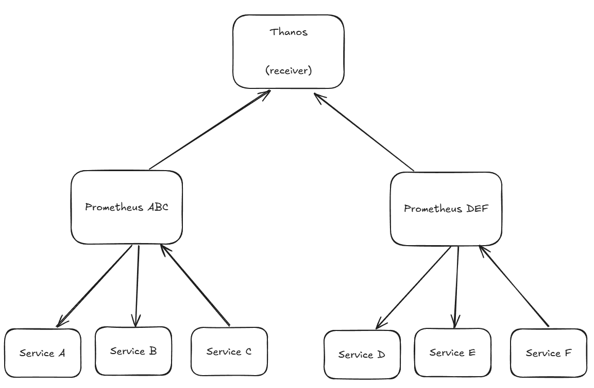

# Qonto technical test

> qonto.notion.site/skill-test-sre-observability-1a431ee4c696803a88f4f378f05b80e4

## Pick My brain

To ensure to have enough time for the other part, I will skip this part for now. Lets talk about it during the technical interview.

## System Design

### Requirements

To run this application, you will need:
* Docker
* Golang (version 1.24.1)

### Build the application

To build the application, you will need to run the following command depending if you want to deploy it more easily in your laptop with Golang or with a Docker container:
```bash
# Build with Golang
go build -o weather ./cmd

# Build with Docker
docker build -t adbo-technical-test:v0.0.1 .
```

### Run the application

To run the application in your laptop with golang, you will needs to ensure that the following environment variable was setup:
```bash
export OPENWEATHERMAP_API_KEY=<the api key>
export CITY_FILE_PATH=./cities.txt

# Then simply run the weather binary
./weather
```

To run the application with docker, you can run the following command:
```bash
docker run --env OPENWEATHERMAP_API_KEY="<api key>" --env CITY_FILE_PATH="/app/cities.txt" -v ./cities.txt:/app/cities.txt -p 2112:2112 adbo-technical-test:v0.0.1
```

Normally, you should be able to see the exporter expose it metrics in the address localhost:2112.

### Explaination of the implementation

When I read the explaination about the exercise, I first saw two things :
* There is a rate limit system in the openweathermap api which limit the number of requests to 50qpm
* There is 100 cities in the document

This means that I will need to find a way to avoid this rate limiting. Moreover, there is no limitation in term of refresh time of the metrics of the differents cities.

At the beginning, I start to play with the API to understand how it works and I find a shortcut using the name of the city instead of the latitude and longitude of the city. So I choose to use it in a dedicated module.

First, I chosen to read the file content and generate Batches of 50 cities. These batches will be used into a goroutine, to request the API 50 per 50 and give the result to the prometheus gauge with a dedicated label to permits to identify which temperature is in which city. The main problem of doing this is that it improves the delay to get every city if the number of city increase.

I have choose to implement a quick json logger to make it more easier to parse into an elasticsearch/loki.

I lose a lot of time in a stupid problem: when I run the Dockerfile for the first time, I forgot to give it access to the file with cities inside and the program was running without doing nothing...

If I have more time, I will:
* clean my code, it is truely horrible sorry about this. I would create clean modules to handle each part.
* add tests with Stub to permits to test modules
* potentially add a Makefile and a docker-compose to ease the use of the container and being able to see the metrics in Prometheus (or even better Grafana)

## Usecases

### Scenario 1

> An application has an alert set on a high ratio of 5XX requests (10% of the total requests).

> The setup works well during the day but at night, when the traffic is low, it frequently gets triggered, waking up the SRE on-call.

> - What can we do to improve this situation?

A 5XX error is an error from the server which has a malfunction during it process. We need to identify what is the source of the malfunction using logs (stacktrace generation) or even trace to get the payload of the request.

A must have could be a system which would catch the request if in 5XX to permits to replay it during daytime and try to reproduce the bug.

### Scenario 2

> Our Prometheus instance is using a lot of memory and there is a trend of constant increase from week to week. Further vertical scaling the instance is not a possibility.
>
> - How can we tackle this issue?

I would setup a Prometheus federation strategy to dispatch the load between multiple Prometheus instances. Then I can use a remote-write system to aggregate everything into a top prometheus system or a better system like Mimir or Thanos for example which can scale the Write capability especially for this use-case.



### Scenario 3

> Every first day of the month, there’s a job running consolidating thousands of transactions. The job first downloads transactions from an S3 bucket and then call different micro services for each one.

> - What solution can you propose to be able to investigate fast when there is an issue with this job?

Here, I see three possible improvements:
* 1. I would retrieve logs and metrics (system) of the job to ensure there is no memory issue due to the possible size of the information.
* 2. I would send a metric at the beginning and at the end of the job to ensure the job has been to the end.
* 3. I would implement traces to permits to identify which part of the job goes wrong when trying to connect with a microservice. This will permit to get context about the situation (payload, service...)