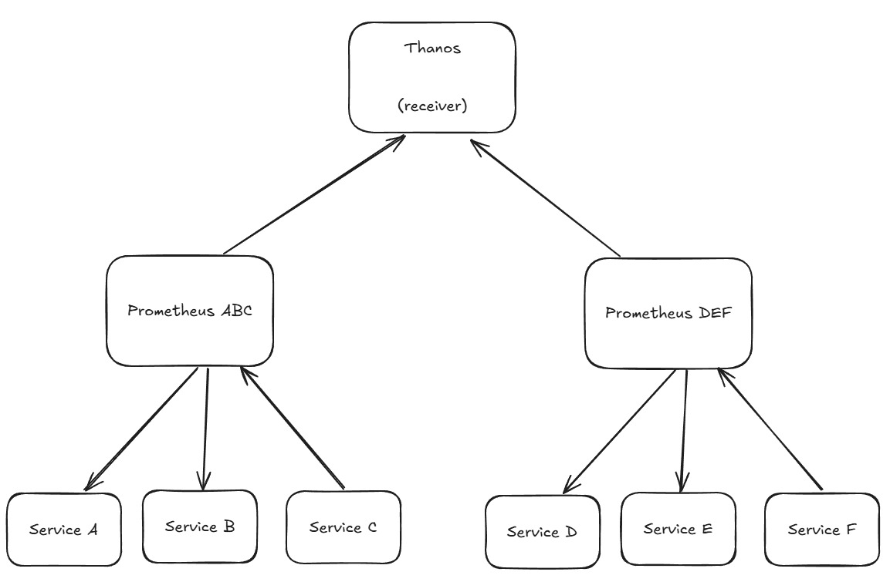

## Usecase

### Scenario 1

> An application has an alert set on a high ratio of 5XX requests (10% of the total requests).

> The setup works well during the day but at night, when the traffic is low, it frequently gets triggered, waking up the SRE on-call.

> - What can we do to improve this situation?

A 5XX error is an error from the server which has a malfunction during it process. We need to identify what is the source of the malfunction using logs (stacktrace generation) or even trace to get the payload of the request.

A must have could be a system which would catch the request if in 5XX to permits to replay it during daytime and try to reproduce the bug.

### Scenario 2

> Our Prometheus instance is using a lot of memory and there is a trend of constant increase from week to week. Further vertical scaling the instance is not a possibility.
>
> - How can we tackle this issue?

I would setup a Prometheus federation strategy to dispatch the load between multiple Prometheus instances. Then I can use a remote-write system to agregate everything into a top prometheus system or a better system like Mimir or Thanos for example which can scale the Write capability espacially for this usecase.

### Scenario 3

> Every first day of the month, there’s a job running consolidating thousands of transactions. The job first downloads transactions from an S3 bucket and then call different micro services for each one.

> - What solution can you propose to be able to investigate fast when there is an issue with this job?

Here, I see three possible improvement:
* 1. I would retrieve logs and metrics (system) of the job to ensure there is no memory issue due to the possible size of the information.
* 2. I would send a metric at the beginning and at the end of the job to ensure the job has been to the end.
* 3. I would implement traces to permits to identify which part of the job goes wrong when trying to connect with a microservice. This will permits to get context about the situation (payload, service...)